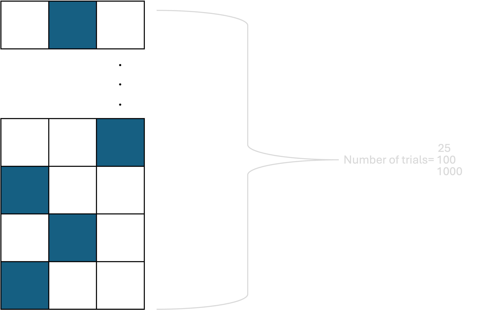

# MODEL

## Background:

In this task there are two agents: architects and builders (see: [McCarthy et al. (2023)](https://github.com/cogtoolslab/compositional-abstractions-tutorial?tab=readme-ov-file)). Among the instructions were 3 options:

The builder must place a block either to the left, in the middle or to the right place (see Figure 1).

{width="348"}

Every instruction began with "Place block" part and than came the placement instruction. [instructions.py](instructions.py) contains the available instructions. For the instruction selection the [nltk library](https://www.nltk.org) (Steven et al., 2009)) was used. I created a dictionary, where each instructions containing their synonyms. That was called in [model.py](model.py).

In [mod](model/model.py)[e](model.py)[l.py](model/model.py) there are two agents: Architect and Builder. The Architect gives instructions like "Place block right", and the Builder is following those order. To be more realistic I added 20% misinterpretation rate, where builder will misinterpret the instruction. It learns also from its mistakes. Architect learns about the most successful words within the keys (e.g. within right, right field might be more successful than rightfield). There are simulations containing 25, 100 and 1000 trials (see Figure 2.). In the end of the simulation the data is exported into .csv files, located in the [data](../data/) folder.

In the [sanity_check.py](sanity_check.py) file I created a sanity check to make sure the success rate is calculated correctly in [model.py](model.py).

In the file [instruction_length.py](instruction_length.py) two new variable were created for the analysis:

1.  'instruction_length_by_letter' : number of letters in the instruction, spaces included

2.  'instruction_length_by_word' : number of the words.

References:

Bird, Steven, Edward Loper and Ewan Klein (2009), *Natural Language Processing with Python*. O’Reilly Media Inc.